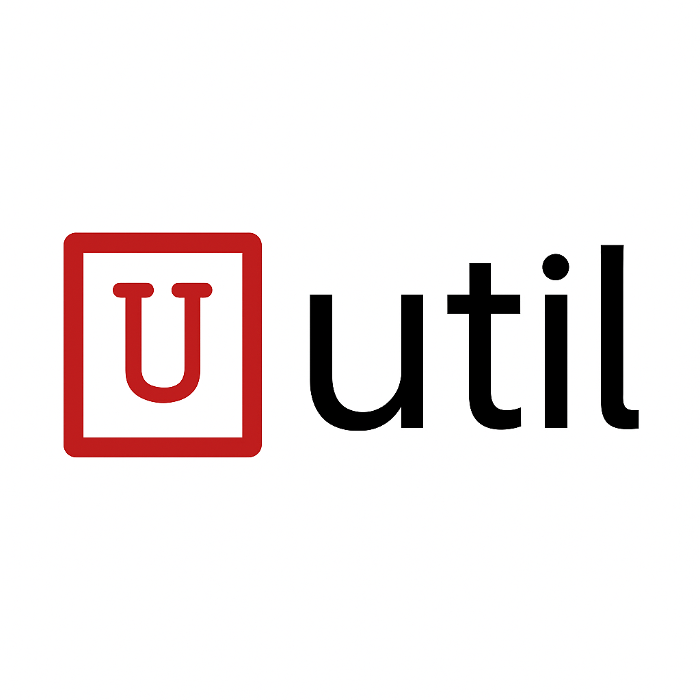

<p align="center">
  
</p>

<p align="center">
  
  
  
</p>

## Overview

Util is a modern, lightweight C utility library that extends the standard C library by providing additional essential modules. Designed with simplicity and modularity in mind, it offers a collection of reusable components that can be easily integrated into any C project.

### Key Features

-   **Modular Design**: Each module is independent and can be used separately
-   **Header-Only**: Most modules are header-only, making integration simple
-   **Cross-Platform**: Works on Linux, macOS, and Windows
-   **C++ Compatible**: All modules are compatible with C++ code
-   **MIT Licensed**: Free to use in both open-source and commercial projects
-   **Zero Dependencies**: No external dependencies required
-   **Modern C**: Written in modern C with clean, maintainable code

## Documentation

**[Full Documentation](https://your-docs-url-here)** - Complete API reference and usage guide

## Quick Start

Everything is managed through Makefile. Use `make help` to see detailed commands:

```
USAGE:
	make all	    		build all modules
	make clean	    		clean builds
	make list	    		list all modules
	make help	    		show this help message
	make test-[module]  	build test for [module]
	make clean-[module] 	clean test for [module]
	make clean-all      	completely clean all builds
	make install	    	install headers to install path
	make docs	    		build and serve documentation
```

### Installation

1. Clone the repository:

```bash
git clone https://github.com/unsigend/util.git
```

2. Configure modules in `config/config.mk` (all modules are included by default)

3. Build and install:

```bash
make all
make install
```

## Why Util?

-   **Simplicity**: Each module is designed to be simple to use while providing powerful features
-   **Modularity**: Use only what you need, reducing code bloat
-   **Maintainability**: Clean, well-documented code that's easy to understand and modify
-   **Reliability**: Thoroughly tested with comprehensive unit tests
-   **Community**: Open to contributions and improvements

## Contributing

Contributions are welcome! Whether it's:

-   Bug reports
-   Feature requests
-   Documentation improvements
-   Code contributions

Please feel free to:

1. Open an issue to discuss proposed changes
2. Fork the repository
3. Submit a pull request

## License

This project is licensed under the [MIT License](https://github.com/unsigend/util/blob/main/LICENSE).
Copyright (C) 2025 - 2026 QIU YIXIANG
