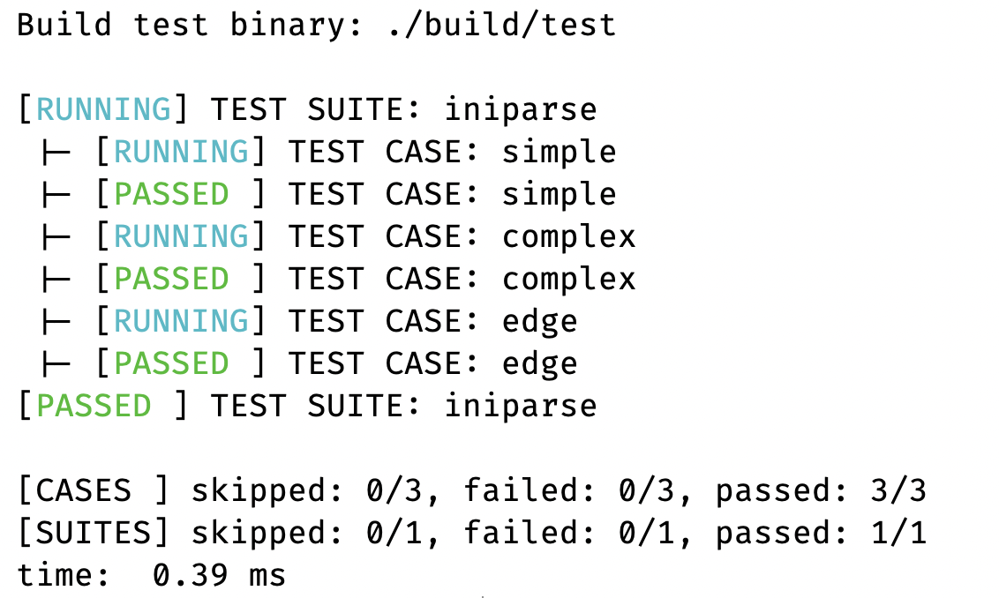

# utest

## Overview

`utest` is a macro-based unit testing framework with built-in multi-threading support. The single include needed is `utest.h`, all other headers are pulled in transitively.

Tests are organized in a two-level hierarchy: suites contain cases. A suite is a function that registers and runs cases; cases are functions that execute assertions. The framework collects results across all suites and prints a final summary.

Suites can be run sequentially or in parallel across a thread pool, where each thread pulls the next unstarted suite from a shared queue.



## Flags

Flags control output verbosity and failure behavior. Pass them to `UTEST_INIT` or toggle them at runtime with `UTEST_ADDFLAG` / `UTEST_CLRFLAG`.

| Flag              | Effect                                                       |
| ----------------- | ------------------------------------------------------------ |
| `UTF_SHOWSUITE`   | Print suite begin/end markers                                |
| `UTF_SHOWCASE`    | Print case begin/end markers                                 |
| `UTF_STOPONSUITE` | Stop dispatching new suites after the first suite failure    |
| `UTF_STOPONCASE`  | Skip remaining cases in a suite after the first case failure |
| `UTF_DEFAULT`     | Default flag set applied when 0 is passed to `UTEST_INIT`    |

## Macros

### Lifecycle

#### `UTEST_INIT(flags)`

Initializes the framework. Must be called before any other macro. Pass 0 to use `UTF_DEFAULT`.

#### `UTEST_FINI()`

Finalizes the framework, prints the summary, and releases all resources. Must be called after all suites have run.

#### `UTEST_ADDFLAG(flag)`

Adds a flag to the active flag set.

#### `UTEST_CLRFLAG(flag)`

Clears a flag from the active flag set.

---

### Defining suites and cases

#### `UTEST_SUITE(name)`

Defines a suite function. The body registers and runs cases via `UTEST_RUNCASE`.

```c
UTEST_SUITE(my_suite) {
    UTEST_RUNCASE(my_case);
}
```

#### `UTEST_CASE(name)`

Defines a case function. The body contains assertions.

```c
UTEST_CASE(my_case) {
    EXPECT_EQ_INT(add(1, 2), 3);
}
```

---

### Registration and execution

#### `UTEST_ADDSUITE(name)`

Registers a suite with the framework. Must be called after `UTEST_INIT` and before any run macro.

#### `UTEST_RUNCASE(name)`

Runs a case inside a suite body. Must be called from within a `UTEST_SUITE` block.

#### `UTEST_RUNSUITE(name)`

Runs a single registered suite by name. Returns 0 on success, -1 if the suite is not found.

#### `UTEST_RUNSUITES()`

Runs all registered suites sequentially.

#### `UTEST_RUNSUITES_THREAD(nthreads)`

Runs all registered suites in parallel using a thread pool of `nthreads` threads. Each thread pulls the next unstarted suite from a shared work queue, so suites are distributed dynamically. Suite-level output is buffered per suite and flushed atomically to avoid interleaving.

#### `UTEST_SHOWSUITES()`

Prints the names of all registered suites to stdout.

---

### Assertions

All assertion macros follow the naming convention `EXPECT_<OP>_<TYPE>(actual, expect)`. A failing assertion marks the current case as failed and logs the failure, but does not abort the case.

**Boolean**

- `EXPECT_TRUE(expr)`, `EXPECT_FALSE(expr)`

**Pointer**

- `EXPECT_NULL(ptr)`, `EXPECT_NOTNULL(ptr)`
- `EXPECT_EQ_PTR`, `EXPECT_NE_PTR`, `EXPECT_GT_PTR`, `EXPECT_GE_PTR`, `EXPECT_LT_PTR`, `EXPECT_LE_PTR`

**Integer**

- `EXPECT_EQ_INT`, `EXPECT_NE_INT`, `EXPECT_GT_INT`, `EXPECT_GE_INT`, `EXPECT_LT_INT`, `EXPECT_LE_INT`

**Unsigned integer**

- `EXPECT_EQ_UINT`, `EXPECT_NE_UINT`, `EXPECT_GT_UINT`, `EXPECT_GE_UINT`, `EXPECT_LT_UINT`, `EXPECT_LE_UINT`

**Character**

- `EXPECT_EQ_CHAR`, `EXPECT_NE_CHAR`, `EXPECT_GT_CHAR`, `EXPECT_GE_CHAR`, `EXPECT_LT_CHAR`, `EXPECT_LE_CHAR`

**Unsigned character**

- `EXPECT_EQ_UCHAR`, `EXPECT_NE_UCHAR`, `EXPECT_GT_UCHAR`, `EXPECT_GE_UCHAR`, `EXPECT_LT_UCHAR`, `EXPECT_LE_UCHAR`

**Double**

- `EXPECT_EQ_DOUBLE`, `EXPECT_NE_DOUBLE`, `EXPECT_GT_DOUBLE`, `EXPECT_GE_DOUBLE`, `EXPECT_LT_DOUBLE`, `EXPECT_LE_DOUBLE`

**String**

- `EXPECT_EQ_STR`, `EXPECT_NE_STR`, `EXPECT_GT_STR`, `EXPECT_GE_STR`, `EXPECT_LT_STR`, `EXPECT_LE_STR`

## Example

```c
#include <utest.h>

/* test cases */
UTEST_CASE(test_add) {
    EXPECT_EQ_INT(1 + 1, 2);
    EXPECT_NE_INT(1 + 1, 3);
}

UTEST_CASE(test_str) {
    EXPECT_EQ_STR("hello", "hello");
    EXPECT_NULL(NULL);
}

/* suite groups related cases */
UTEST_SUITE(math_suite) {
    UTEST_RUNCASE(test_add);
}

UTEST_SUITE(str_suite) {
    UTEST_RUNCASE(test_str);
}

int main(void)
{
    UTEST_INIT(0); /* use default flags */

    UTEST_ADDSUITE(math_suite);
    UTEST_ADDSUITE(str_suite);

    /* run all suites across 4 threads */
    UTEST_RUNSUITES_THREAD(4);

    UTEST_FINI();
    return 0;
}
```
